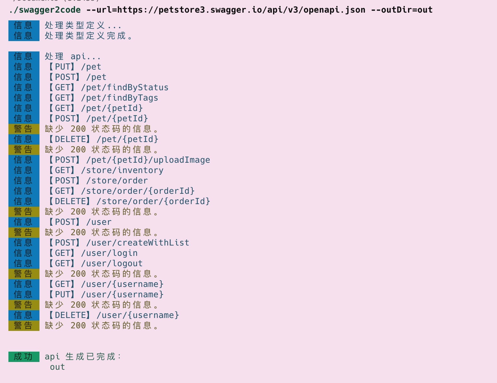

# swagger2code

🔧 Swagger 文档自动生成接口文件。

特性：

- [x] 覆盖 ~95% 已知 Swagger 文档。
- [x] 支持 Swagger 2/3。
- [x] 支持 Axios、Wechat。
- [x] 生成 TypeScript。

## 快速开始

⚠️ 由于工具基于 `Deno` 实现，使用前确保已经安装 [Deno](https://github.com/denoland/deno#install) 环境。

### 使用

⚠️ 注意：deno 不会解析 `~`字符为用户主目录。

```sh
swagger2code --url=https://petstore3.swagger.io/api/v3/openapi.json --outDir=out
```




