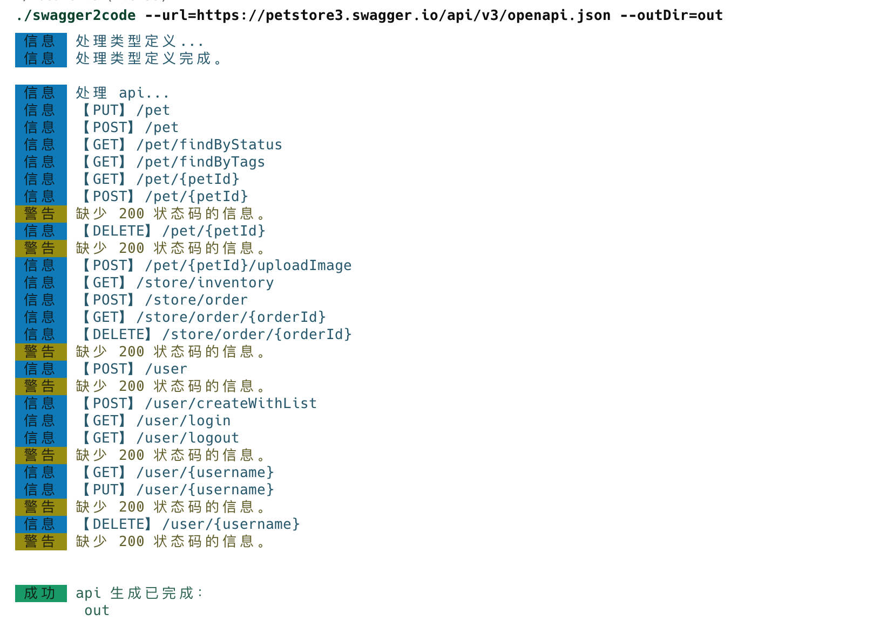
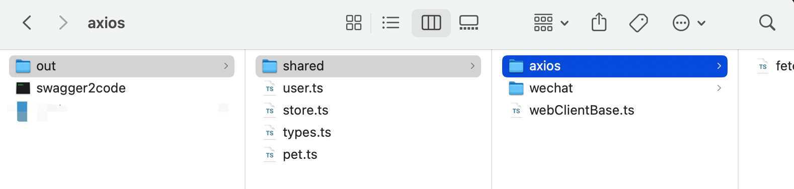

# <p align="center">STC</p>

<p  align="center"></p>

STC (Swagger Transform Code) is a tool for converting OpenApi/Swagger/Apifox into code.


[](https://github.com/long-woo/stc/actions/workflows/npm.yml)

[](https://jsr.io/@loongwoo/stc)


<div align="center">
  
</div>

## Features

> 🚧 Encapsulate the "shared" directory.

- 🐹 Support for **Swagger 2/3(OpenApi)** and **Apifox**.
- 💡 Support plug-in development.
- 🐣 Built-in transformation languages:
  - **TypeScript**, almost equivalent to handwriting. Depends on **`axios`, `wx.request`, `fetch`**.
   > `xhr/ajax、ofetch` planned
  - **JavaScript**, from TypeScript to it.
  - **Dart**, dependency on **`dio`**.
  - 🚧 **Swift** ...

## Quick start

### Download executable files

[download](https://github.com/long-woo/stc/releases) by system：

- stc: Intel-based Mac
- stc-m: M-series Mac
- stc-linux：Linux
- stc-win.exe: Windows

### NPM

1.Install the `@loogwoo/stc` npm package.

```sh
pnpm add @loongwoo/stc -D
```

2.Open the project's `package.json` file and add the following command to `scripts`:

```json
{
  "scripts": {
    "api": "stc --url=http://127.0.0.1:4523/export/openapi/2?version=3.1"
  }
}
```

### Use

⚠️ Note: deno will not parse the `~` character as the user's home directory.

```sh
stc --url=https://petstore3.swagger.io/api/v3/openapi.json --outDir=out
```





### Existing Project

Assume a project directory is:

```
.
├── src
│   └── apis # Copy the shared directory here.
│       └── shared
│       └── xxx.ts # Other files.

```

#### Axios

1. Find the directory of `outDir`, copy the entire `shared` directory to the directory of the `axios` module you encapsulated.

2. Open the `shared > axios > index.ts` file, copy the `request` method, and add it to the `axios` module you encapsulated. If it is not encapsulated, copy the `index.ts` file as a new file to avoid the problem of modification being overwritten.

3. Taking `Vue` as an example, add the following code to the `main.ts` file:

```ts
import { createApiClient } from './apis/shared/fetchRuntime';

createApiClient({
  baseURL: 'https://api.xxx.com'
  // onError(msg) {
  //   // 处理错误信息
  // }
})
```

#### Wechat

1. Find the directory of `outDir`, copy the entire directory of `shared` to the directory of the `wechat` module you encapsulated.

2. Open the `shared > wechat > ​​index.ts` file, copy the `request` method, and add it to the `wx.request` code file you encapsulated. If it is not encapsulated, copy the `index.ts` file as a new file to avoid the problem of modification being overwritten.

3. Add the following code to the `app.ts` file:

```ts
import { createApiClient } from './apis/shared/fetchRuntime';
// import Notify from './miniprogram_npm/@vant/weapp/notify/notify';

App<IAppOption>({
  onLaunch() {
    createApiClient({
      baseURL: 'https://api.xxx.com,
      onError(msg) {
        // Notify({ type: 'danger', message: msg, selector: '#v-notify'})
      }
    })
  }
});
```

### Options

| Option      | Alias | Type     | Default   | Description                                                                                                  |
| ----------- | ----- | -------- | --------- | ------------------------------------------------------------------------------------------------------------ |
| url         |       | string   |           | Swagger/OpenApi/Apifox document address, or local path.                                                      |
| outDir      | o     | string   | ./stc_out | Output Directory.                                                                                            |
| client      |       | string   | axios     | http request client. When `lang` is `ts/js`, the possible values ​​are: `axios`, `wechat`, `fetch`.            |
| lang        | l     | string   | ts        | Language, used for output file suffix.                                                                       |
| tag         |       | number   |           | Specify the tag from the interface url. By default, the first tag is read for the file name.                 |
| filter      | f     | string[] |           | Filter interfaces. Interfaces that meet the filter conditions will be generated. Example: `--filter "/pet*"`, generate an interface for `/pet`, and support multiple `--filter`. For more usage information, please refer to [micromatch](https://github.com/micromatch/micromatch) |
| conjunction | c     | string   | By        | The method's connector, the default value is `By`.                                                           |
| actionIndex |      | number   | -1        | The method name index, the default value is `-1`.                                                            |
| version     | v     | boolean  |           | Output version information.                                                                                  |
| help        | h     | boolean  |           | Output help information.                                                                                     |

## Plug-in development

For convenience, STC can not only develop plugins in Deno, but also provides `@loongwoo/stc` npm library, which can develop plugins in Node environment.

[examples](https://github.com/long-woo/stc/tree/master/examples)

### Deno

⚠️ Prepare the [Deno](https://github.com/denoland/deno#install) environment.

Create a `myPlugin.ts` file:

```ts
// 引用模块
// import { start } from 'https://deno.land/x/stc@2.6.1/mod.ts'
import { start } from 'jsr:@loongwoo/stc@^2.6.1'

// Defining plugins
const myPlugin: IPlugin = {
  name: 'stc:MyPlugin',
  lang: 'ts',
  setup(options) {
    console.log(options)
  },
  onTransform(def, action) {
    // definition
    const defContent: string = parserDefinition(
      def
    )
    // action
    const actionContent: Map<string, string> = parserAction(
      action
    )

    return {
      definition: {
        filename: '_types.ts',
        content: defContent,
      },
      action: actionContent // Here actionContent is of type Map<string, string>, key is the file name, value is the converted code.
    }
  },
  onEnd() {
    console.log('end')
  }
}

// 使用插件
start({
  // ...其他配置
  plugins: [myPlugin]
})
```

### Node

1. Create a `myPlugin.ts` file.

2. Add the `@loongwoo/stc` reference and use the `start` method:

```ts
import { start } from '@loongwoo/stc'
```

3. Implement the code that converts `definition` and `action` into the target language in the plugin's `onTransform` hook function.

```ts
export const myPlugin: IPlugin = {
  name: 'stc:MyPlugin',
  lang: 'ts',
  setup(options) {
    console.log(options)
  },
  onTransform(def, action) {
    // definition
    const defContent: string = parserDefinition(
      def
    )
    // action
    const actionContent: Map<string, string> = parserAction(
      action
    )

    return {
      definition: defContent,
      action: actionContent
    }
  },
  onEnd() {
    console.log('end')
  }
}
```

4.In the `start` method, add `plugins`:

```ts
start({
  // ...other options
  plugins: [myPlugin]
})
```
